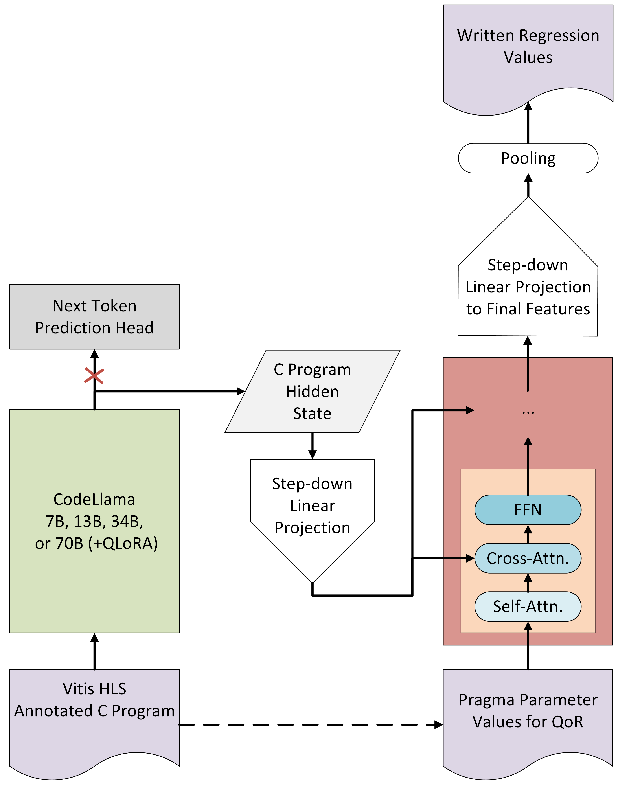

# QoR Estimation and Automated DSE for HLS Driven by AI
For the following Kaggle competition focused on QoR regression and automated DSE: 

https://www.kaggle.com/competitions/machine-learning-contest-for-high-level-synthesis/overview

## Instructions for Repository Set-Up

Setting up for this repository should be relatively simple. Python >=3.12 is recommended. As an example for Bash when at the top of this repository:

```
python3 -m venv new-venv
source new-venv/bin/activate
pip install -r requirements.txt
```

The dataset must be downloaded separately. It's available on the [Kaggle competition page](https://www.kaggle.com/competitions/machine-learning-contest-for-high-level-synthesis/overview) and potentially on the [HLSyn repository](https://github.com/UCLA-DM/HLSyn).

## Project Description: QoR Estimations via Regression

### Description of Competition Phase and Data

The first phase of the competition asks for 6-feature regressions focused on Quality-of-Results (QoR) estimation. The dataset provides raw code in annotated C (meant to be consumed by Vitis HLS) in addition to abstract syntax trees. The former is suitable for consumption by language models whereas the latter can be used for GNNs pretty much out of the box. Every sample in the dataset also comes with optimization parameters that take the form of `pragmas` for Vitis HLS, defining the QoR. The goal is to take all of these input values and accurately predict the following values:

| Feature | Description |
| ------- | ----------- |
| Validity | `0 or 1`, a design and parameter configuration can also be invalid if utilization is too high (e.g. >80%). |
| Performance | Clock cycles as an `integer`, can range wildly in value. Zero for designs that are entirely invalid. |
| Utilization of BRAM | Proportion of utilization over time as a `float from 0 to 1`. |
| Utilization of LUT | Proportion of utilization over time as a `float from 0 to 1`.  |
| Utilization of DSP | Proportion of utilization over time as a `float from 0 to 1`.  |
| Utilization of FF | Proportion of utilization over time as a `float from 0 to 1`.  |


### Initial Approach Ideas

Based on the work of one of the labs sponsoring this competition at UCLA, found [here](https://proceedings.neurips.cc/paper_files/paper/2023/file/8dfc3a2720a4112243a285b98e0d4415-Paper-Datasets_and_Benchmarks.pdf), a few ideas initially emerge. They're detailed below from easiest to implement to hardest to implement. 

#### CodeLlama Embeddings + Classifying Bidirectional Decoder
CodeLlama is capable of generating complicated embeddings representing code blocks. While those embeddings are meant for next-token prediction for foundational decoder models, it can almost certainly be adapted similarly to the embeddings ripped from bidirectional language models like [CodeBert](https://arxiv.org/abs/2002.08155). The only issue here is that Vitis HLS pragmas are almost certainly foreign to CodeLlama, but that can be dealt with via fine-tuning (combined with QLoRA, we can probably use the 70B model so long as we FSDP). 

Fine-tuning on such a dataset would be expensive if we try to use CodeLlama for the entire process, not to mention it's a bit nonsensical. Given that, we can instead use a smaller model that we train from scratch based on the pragma values and CodeLlama embeddings. Basic structure is outlined in the image below:

<p align="center">
   
</p>

#### Joint Embedding with CodeLlama and GNN + Classifying Bidirectional Decoder

The above idea, but adding a GNN embedding as well after feeding in the AST. Some T5-like code-focused model might work. 

#### Pre-trained from Scratch GraphCodeBERT + Classifying Bidirectional Decoder

Easily the most expensive idea, this would replace the CodeLlama element of above ideas and the GNN portion of a joint embedding with a [GraphCodeBERT](https://arxiv.org/abs/2009.08366) only pretrained on C and then fine-tuned on the Vitis HLS annotated C. Has to be pretrained from scratch, as GraphCodeBERT doesn't support C out-of-the-box. 
